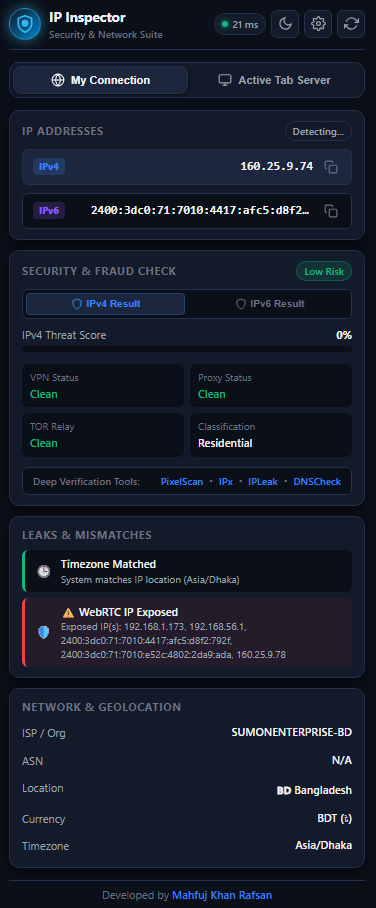
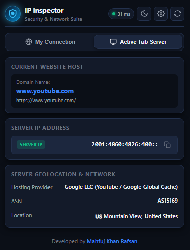

# 🛡️ IP & Security Inspector

A powerful, high-performance browser extension designed to inspect your public IPv4/IPv6 addresses, active tab server details, geolocation, ISP provider, fraud threat risk score, VPN/Proxy detection, WebRTC leaks, and timezone mismatches.

Developed by **[Mahfuj Khan Rafsan](https://zaap.bio/mahfuj)**.

---

## 📥 Downloads & Releases

- 📦 **Download Latest Release:** [GitHub Releases](https://github.com/mahfujkn/ip-security-inspector/releases)

---

## 📸 Screenshots

<table align="center">
  <tr>
    <th align="center">My Connection Overview</th>
    <th align="center">Active Tab Server Geolocation</th>
  </tr>
  <tr>
    <td align="center" valign="top">
      
    </td>
    <td align="center" valign="top">
      
    </td>
  </tr>
</table>

---

## ✨ Features

- 🌐 **Public IPv4 & IPv6 Inspection:** Displays your real public IP addresses with instant one-click copy and auto-copy capabilities.
- 🏢 **Active Tab Server Geolocation:** Captures the current website's host server IP, hosting provider (e.g. Meta, Google, Cloudflare, AWS, Vultr, PLDT), ASN, and server location in real time.
- ⚡ **3-Tier Anycast Latency Checker:** Measures live network latency using a 3-tier Anycast pipeline (1st: Cloudflare 1.1.1.1 Edge, 2nd: Google Public DNS, 3rd: Quad9 Secure DNS).
- 🚩 **250+ HD World Country Flags & ISO Badges:** Features dedicated 32x32 HD country flag icons for all 250 ISO country codes and dynamic toolbar badges (Green for Clean residential, Red for VPN/Proxy).
- 🛡️ **VPN & Datacenter Detection:** Identifies commercial hosting datacenters (GSL Networks, Vultr, AWS, Hetzner, Cloudflare) and calculates a real-time Fraud Threat Score (0% - 100%).
- 🔒 **WebRTC Leak & Timezone Checker:** Scans STUN candidates for unmasked local IP leaks and detects mismatches between system local time and IP location time.
- 💱 **Global Currency Mapping:** Displays exact official currency ISO codes and symbols for over 250 countries (e.g. BDT ৳, USD $, KHR ៛, EUR €, INR ₹).

---

## 🚀 Installation Guide

### Method 1: Download Release ZIP (Quickest & Easiest)
1. Go to the official [GitHub Releases Page](https://github.com/mahfujkn/ip-security-inspector/releases).
2. Download the **`IP-Security-Inspector-v1.0.zip`** package from the latest release assets.
3. Extract the downloaded ZIP file to a folder on your computer.
4. Open your browser extensions page:
   - **Google Chrome:** `chrome://extensions/`
   - **Microsoft Edge:** `edge://extensions/`
5. Enable **Developer mode** (toggle in the top-right / sidebar corner).
6. Click **Load unpacked** and select the extracted folder.
7. The **IP & Security Inspector** icon will appear on your browser toolbar!

---

### Method 2: Git Clone (Developer Mode)
1. Clone this repository to your computer:
   ```bash
   git clone https://github.com/mahfujkn/ip-security-inspector.git
   ```
2. Open your browser extensions page (`chrome://extensions/` or `edge://extensions/`).
3. Enable **Developer mode**.
4. Click **Load unpacked** and select the `ip-security-inspector` repository folder.

---

## 🛠️ Technology Stack

- **Extension Framework:** Manifest V3 (Service Worker Architecture)
- **Languages:** HTML5, Modern Vanilla JavaScript (ES6+), CSS3
- **Design System:** Custom Dark/Light Theme with glassmorphism & responsive text wrapping
- **Geolocation APIs:** Parallel multi-provider fallback engine (`ip-api.com`, `ipwho.is`, `freeipapi.com`, `ipapi.co`, APNIC RDAP Registry)

---

## 📄 License & Credits

Distributed under the MIT License. See `LICENSE` for more information.

Developed with ❤️ by **[Mahfuj Khan Rafsan](https://zaap.bio/mahfuj)**
